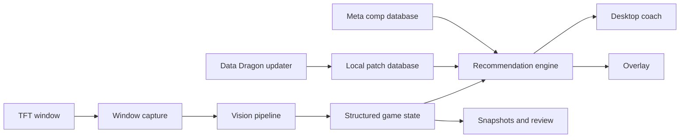

# Architecture

## Modules

- `capture`: finds and captures windows.
- `vision`: maps screen regions and turns screenshots into a `GameState`.
- `data`: downloads official static data and loads editable meta files.
- `advisor`: ranks routes and explains decisions.
- `ui`: desktop control center and overlay.

